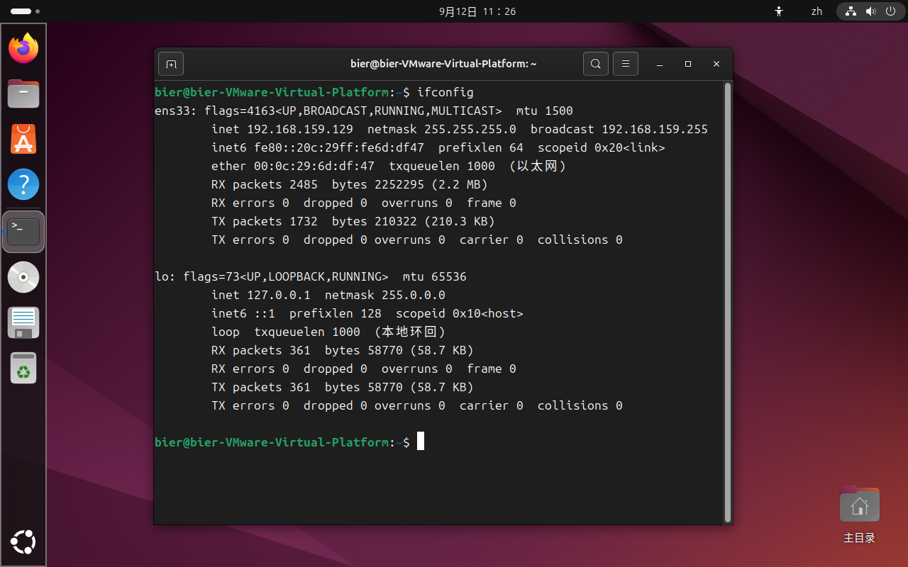
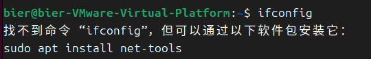
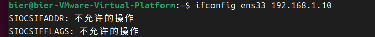
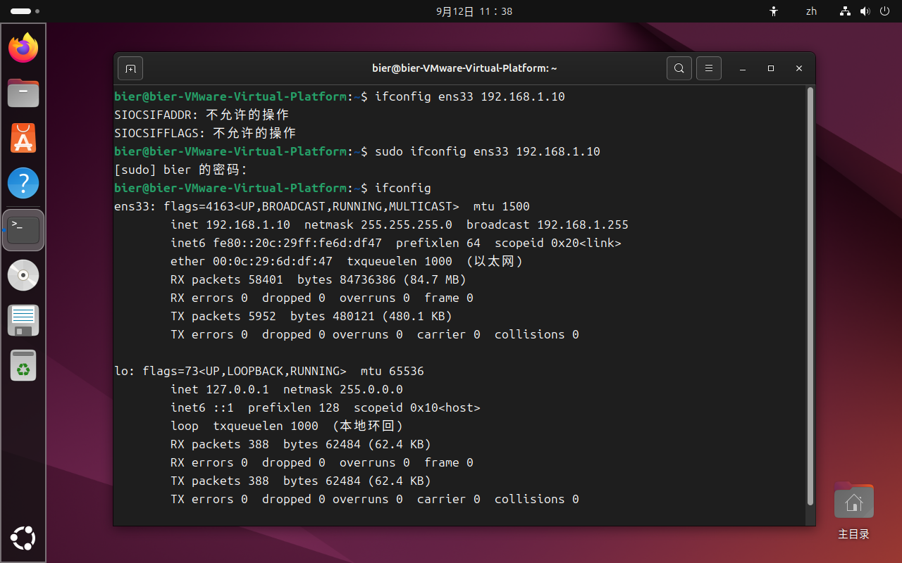
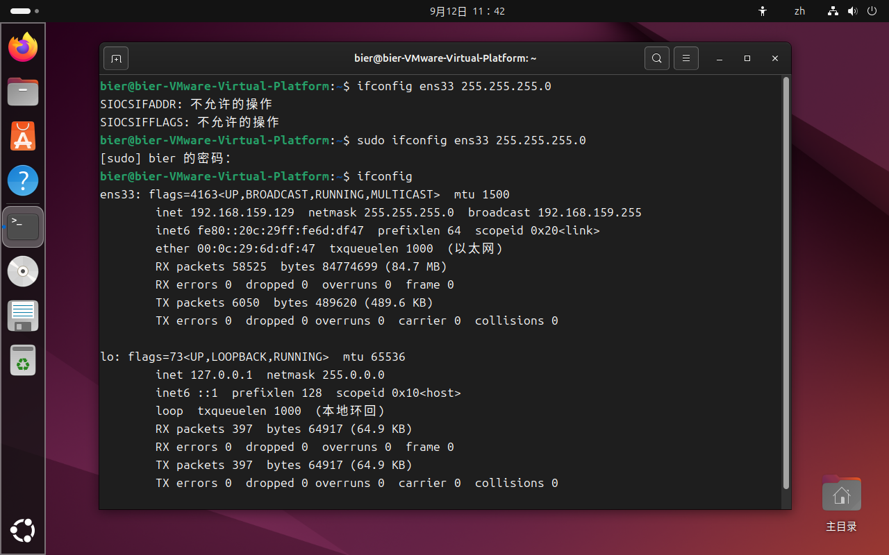
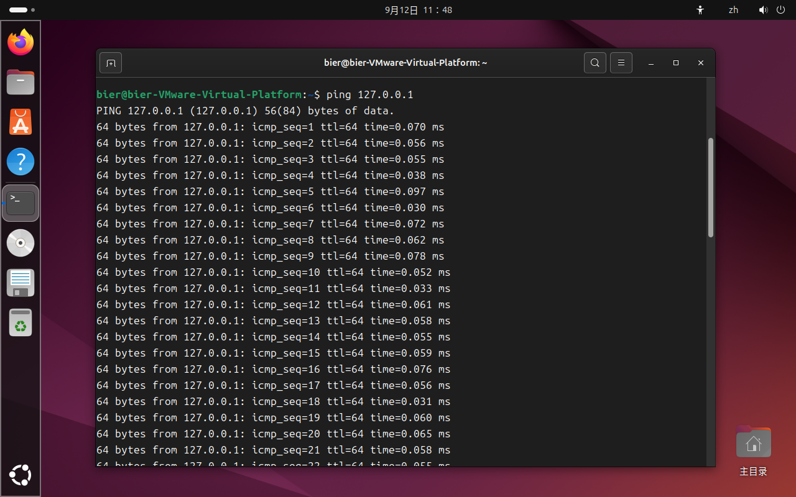
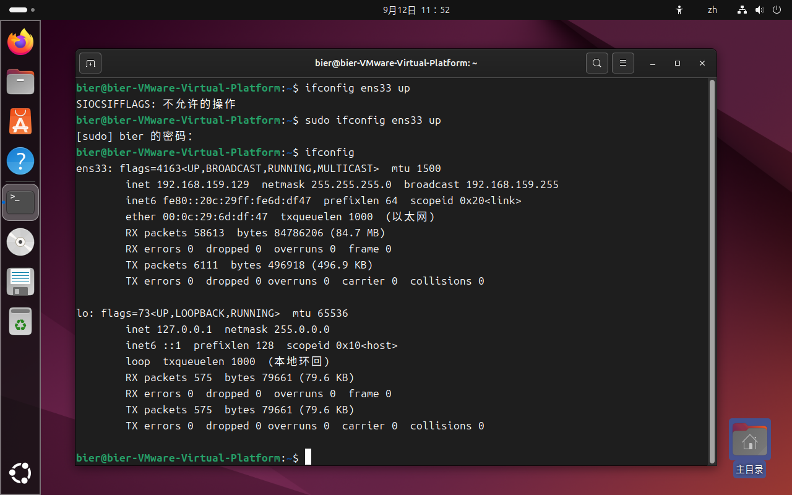
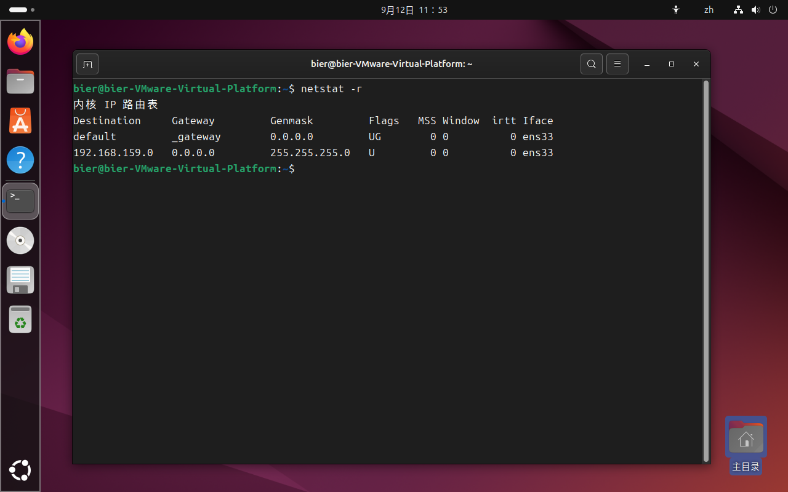
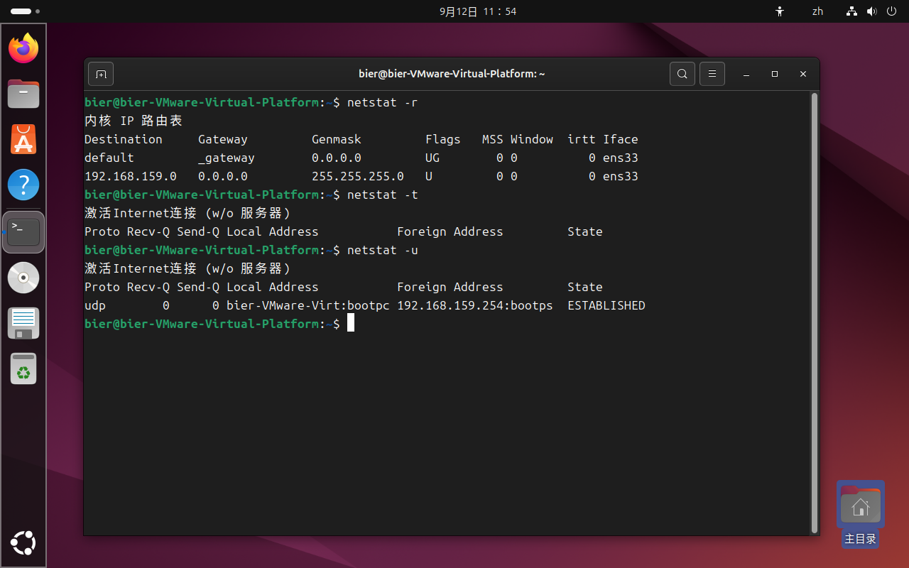

# Experiment 1st: common commands in Linux
group 6
## Purpose of the experiment
1.Be familiar with the use of VirtualBox virtual machines.
2.Be familiar with the Ubuntu operating system。
3.Master the commonly used Linux commands.
## Experimental equipment
1.Hardware:PC machine
2.SOftware:VietualBox virtual machine and Ubuntu operating system
## Experiment pre-study requirements
1.Read Section 1.3 about the installation and use of Linux.
2 Read Section 1.5 Linux Common Operation Commands.
## Experimental content
1. The use of virtual machine-based Linux operating system.
2 The use of commands related to files and directories.
3 Use of disk management and maintenance commands.
4 The use of system management and setting commands.
5 The use of network-related commands.
6 The use of compressed backup commands.
## Experimental Procedure
+ ### Use of the Linux operating system based on virtual machines
1.
+ ### Use of commands related to files and directories
1.
+ ### Use of commands related to Disk Management and maintenance
1.
+ ### Use of system administration and setting commands
1.
+ ### Use of network-related commands
#### 1. Displays information about the current network
Run the following command

`ifconfig`

The information of the current network can be displayed, and the operation result is shown in the figure

If the prompt as shown in the figure appears, you can run the command shown in the diagram to install the package and try again

`sudo apt install net-tools`

#### 2. Set the IP address
Run the following command

`ifconfig ens33 192.168.1.10`

You can set the IP address of ens33 to 192.168.1.10

If the following prompts appear

you can add `sudo` before the command to elevate the privilege, that is, run

`sudo ifconfig enc33 192.168.1.10`

After operation, the IP change is observable

#### 3. Set the subnet mask
Run the following command

`ifconfig ens33 netmusk 255.255.255.0`

You can set the subnet musk of ens33 to 255.255.255.0

After operation, the subnet mask change is observable

#### 4. Disable the NIC
Run the following command

`ifconfig ens33 down`

It can be observed that the NIC ens33 has been disabled

#### 5. Test network connectivity
Run the command

`ping 127.0.0.1`

The result is as follows

This indicates that the local network loop is normal

#### 6. Enable the NIC
Run the command

`ifconfig ens33 up`

It can be observed that the NIC ens33 is enabled

#### 7. Displays the kernel routing table
Run the following command

`netstat -r`

The kernel routing table is displayed
The result is shown in the figure

#### 8. Displays the TCP connection status
Run the following command

`netstat -t`

The TCP connection status is displayed
The result is shown in the figure

#### 9. Displays the UDP connection status
Run the following command

`netstat -u`

The UDP connection status is displayed
The result is shown in the figure

+ ### Use of the Compress Backup command
1.

## Questions
1.
