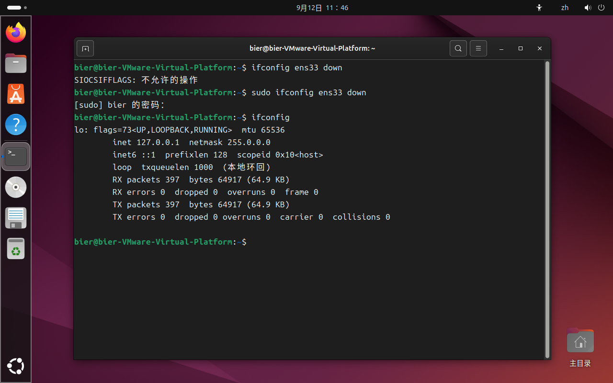

# Experiment 1st: common-commands-in-Linux
group 6
## Purpose of the experiment
1.
## Experimental equipment
1.
## Experiment pre-study requirements
1.
## Experimental content
1.
## Experimental Procedure
### Use of the Linux operating system based on virtual machines
1.
### Use of commands related to files and directories
1.
### Use of commands related to Disk Management and maintenance
1.
### Use of system administration and setting commands
1.
### Use of network-related commands
#### 1.Displays information about the current network
Run the following command

`ifconfig`

The information of the current network can be displayed, and the operation result is shown in the figure

If the prompt as shown in the figure appears, you can run the command shown in the diagram to install the package and try again

`sudo apt install net-tools`

#### 2.Set the IP address
Run the following command

`ifconfig ens33 192.168.1.10`

You can set the IP address of ens33 to 192.168.1.10
If the following prompts appear

you can add sudo before the command to elevate the privilege, that is, run

`sudo ifconfig enc33 192.168.1.10`

After operation, the IP change is observable

#### 3.Set the subnet mask
Run the following command

`ifconfig ens33 netmusk 255.255.255.0`

You can set the subnet musk of ens33 to 255.255.255.0

After operation, the subnet mask change is observable

#### 4.Disable the NIC
Run the following command

`ifconfig ens33 down`

It can be observed that the NIC ens33 has been disabled

#### 5.Test network connectivity
Run the command

`ping 127.0.0.1`

The result is as follows

This indicates that the local network loop is normal

#### 6.Enable the NIC
Run the command

`ifconfig ens33 up`

It can be observed that the NIC ens33 is enabled

#### 7.Displays the kernel routing table
Run the following command

`netstat -r`

The kernel routing table is displayed
The result is shown in the figure

#### 8.Displays the TCP connection status
Run the following command

`netstat -t`

The TCP connection status is displayed
The result is shown in the figure

#### 9.Displays the UDP connection status
Run the following command

`netstat -u`

The UDP connection status is displayed
The result is shown in the figure

### Use of the Compress Backup command
1.
## Questions
1.
